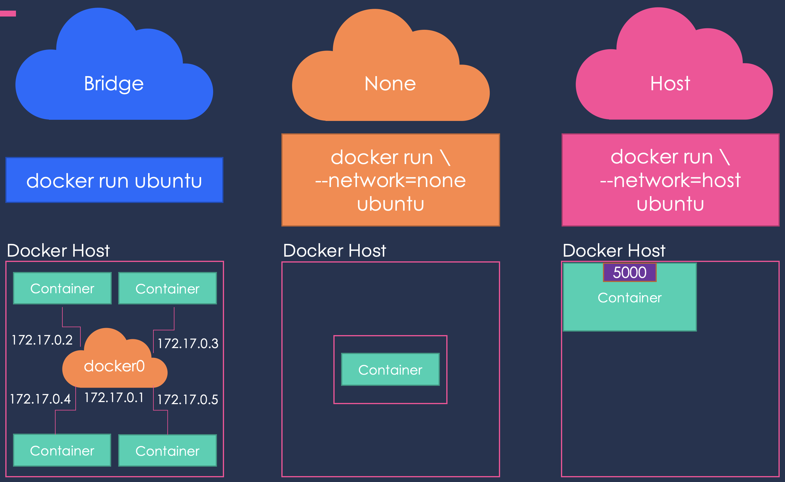

# Networking in Docker

To facilitate communication between different containers on the host machine, docker provides support for multiple types of networks, these include:

- host: In this configuration, the container attaches itself to the host port,therefore this port now can not be used by any other process on the host.
- bridge: This is the default network configuration for every container. Docker creates a network of itself with IP addresses in the subnet 172.17.0.0. In bridge mode, the user can map the container port to a port on the host machine.
- none: Disable networking.
- user-defined: Using `docker network create`, users can create their subnets. It is a good option instead of using the default bridge as it can control which applications are allowed to communicate and which are not.

An illustration:

 

Next, we learn how to run a docker image and create a container, go to the [next lesson](running_docker_container.md)