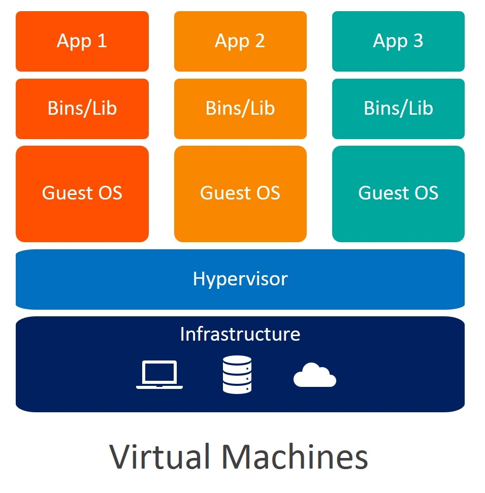
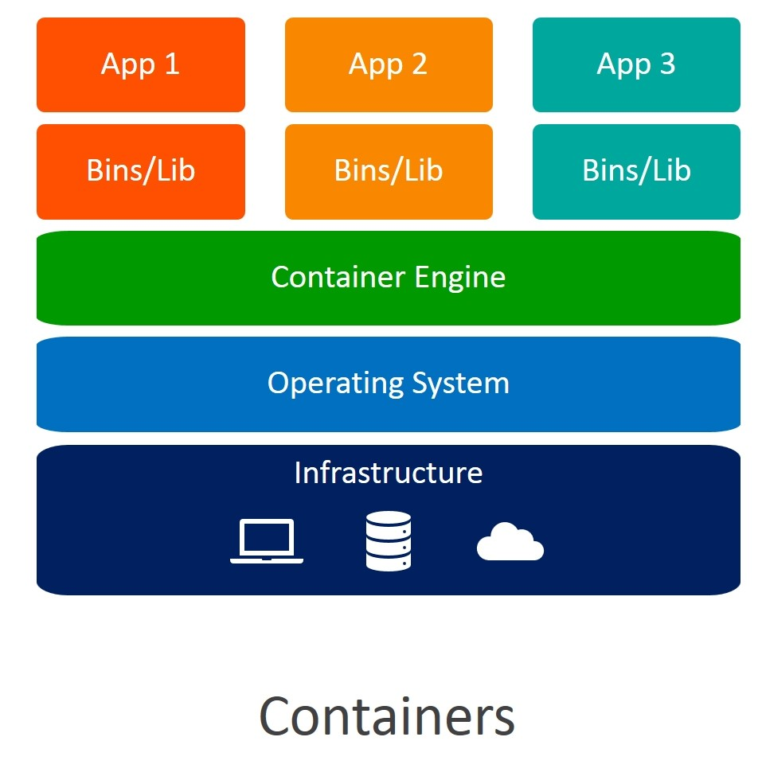
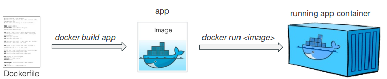

Docker is built to manage containers, therefore it is important to understand the term `containers`

# What is a container?

## The Problem:
In today's date, the software development rate has skyrocketed but this has introduced discrepancies in terms of environment configuration, application isolation, and avoiding resource access conflicts. 

## Solution #1:
A solution for this problem is to use __Virtual Machines__. A Virtual Machine runs an instance of some Operating System and the host machine hardware is virtualized by a bare-metal hypervisor(a software responsible for the allocation of resources to virtual machines). Here's how a VM is set up.

</img>

The reason VMs are not always required to run our applications is that:
- Creation of a VM takes time.
- Boot time of a VM is high.
- Most OS sizes are in GBs.
- Dependencies are needed to be installed from scratch.
- Inability to share a VM instance and recreate the exact environment.
- Hardware resource wastage.

## Solution #2:
Soon __containers__ were introduced and they made it much easy to develop and deploy software applications. These containers are created via software that runs on the host machine serving certain OS. 

*__Here, we do not virtualize hardware but we virtualize the Operating System__*

Here's how containers are set up.

</img>

Containers do not run a complete OS, they operate on kernels. A kernel is a core program in any OS that has complete control over all processes. The size of these kernels is far less as compared to that of an entire OS. For instance, Ubuntu 18.04 LTS is 2.00 GB whereas Ubuntu docker image is 27.25 MB only.

Containers allowed developers to recreate an environment free of all dependency conflicts. Containers run on-demand, they boot quickly and only use resources as and when needed.

 

# What is docker?

Before diving into docker commands and deploying docker containers, let us first understand `What is docker?`

[Docker](https://docker.com) started as an open-source project in 2013 and to put it in the simplest terms, Docker is nothing but software that helps a developer create and manage containers.

Docker components:

- Dockerfile: A Dockerfile is a simple human-readable text file that instructs docker how to build a docker image. Each line in this file is a command in the form `[INSTRUCTION] [ARGUMENT]`.

- Docker image: Docker images are a blueprint of docker containers. It contains information about which software the container will run and how. Docker images are built using Dockerfile.

- Docker container: If the docker image is a blueprint then the docker container is an instance of these blueprints. Docker container takes the specifications from docker image and executes them to create an environment ready to run your application.

An illustration:

</img>

Now it's time to install Docker, start the [next lesson](./docker_installation.md)

Resources:
- (video)[What is Docker? Easy way by hitesh choudhary](https://www.youtube.com/watch?v=-LeV_c1zG-s)
- (video)[What is Docker? by telusko](https://www.youtube.com/watch?v=u-YWtdbpEhQ)
- (article)[Containers vs. VMs: What’s the Difference?by IBM](https://www.ibm.com/cloud/blog/containers-vs-vms)
- (article)[Containers vs. virtual machines by Microsoft](https://docs.microsoft.com/en-us/virtualization/windowscontainers/about/containers-vs-vm)
